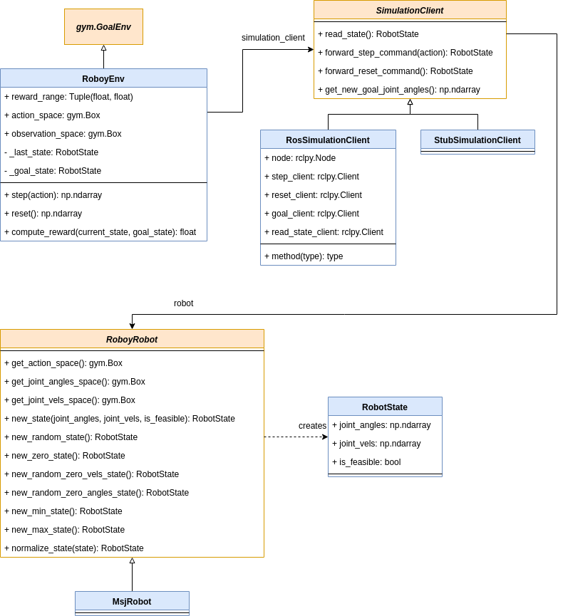

# Goals
This in an implementation of an OpenAI gym environment to train controllers 
for Roboy. They provide standardized interface definitions for RL: https://github.com/openai/gym/tree/master/gym/envs

The goals of this repo are: 
* To provide flexibility for you to train controllers for different 
robots (e.g. MSJ Platfrom, Upper Body, etc.).
* Second, it is straightforward to parallelize the environments s.t.
you can scale the controller training with more compute resources.
* Lastly, we kept it easy to implement communication to  your 
simulation engine of choice (e.g. to MuJoCo, Gazebo, etc.).

# Installation
Python3.5 is required. Either use `python3` and `pip3` variants, 
or activate a Python virtual environment. If you are using the docker container `deepandreinforced/rl:latest`, you
do not need to install this repo again. Otherwise:
```bash
python3 -m pip install -r requirements.txt
python3 -m pip install -e .
```
Installing this repo as a pip package is necessary if you would like to use the 
environment constructor form:
```python
env = gym.make('msj-control-v1')
```
# Structure

- The class `RoboyEnv` implements gym's `gym.GoalEnv`. 
It is the central class in this repo.

#### Directory `simulations/`
- `SimulationClient` is a client interface to talk to our simulations. It provides
the flexibility to change simulation engines by subclassing it.
- `RosSimulationClient` is a subclass of `SimulationClient` that uses ROS services 
to step and reset the simulation. We have used so far CARDSflow as our 
simulation engine (not part of this repo).

#### Directory `robots/`
- `RoboyRobot` is the interface for any robot. You can add new robots
by subclassing from it.
- `MsjRobot` is a subclass of `RoboyRobot` with concrete dimensions and boundaries.

#### Class Diagram
The `RoboyEnv` uses a `SimulationClient` to read values from the simulation.
The `SimulationClient` depends upon a `RoboyRobot` to parse the numbers it
receives from the simulation into a meaningful `RobotState` 




# Run tests
Before running the tests, make sure you have sourced ROS2 with the ROS messages 
of Roboy. In the docker container `deepandreinforced/rl:latest`, this can be done
with the command `source_ROS2_ROBOY_WS`.

To run the unit tests:
```bash
pytest 
```
The repo also has integration tests. To run them, you need a CARDSflow simulation
running as well as the bridge between ROS1 and ROS2. Then, to run the tests, do:
```bash
cd gym_roboy/envs/tests/
bash run_all_tests.sh
```